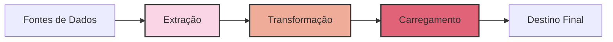
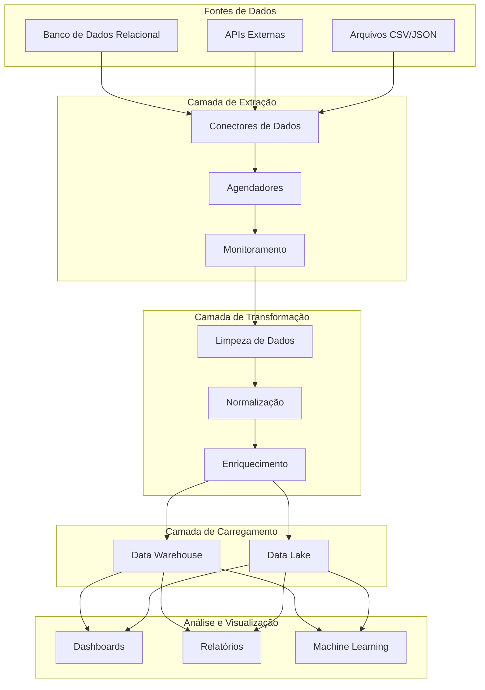

# README do Projeto ETL

## O que é ETL?

ETL (Extract, Transform, Load) é um processo fundamental na engenharia de dados que consiste em três etapas:

1. **Extração** (Extract): Coleta de dados de diversas fontes, como bancos de dados, APIs, arquivos, sistemas legados, etc.
2. **Transformação** (Transform): Limpeza, formatação, enriquecimento e padronização dos dados extraídos.
3. **Carregamento** (Load): Armazenamento dos dados transformados em um destino final, como data warehouse, data lake ou outro sistema de armazenamento.



## O que é Engenharia de Dados?

A Engenharia de Dados é uma disciplina que se concentra na construção e manutenção de sistemas e infraestruturas para coletar, armazenar, processar e disponibilizar dados de forma eficiente e confiável. Os engenheiros de dados são responsáveis por:

- Projetar e implementar pipelines de dados
- Garantir a qualidade e integridade dos dados
- Otimizar o desempenho dos sistemas de dados
- Criar e manter data warehouses e data lakes
- Implementar soluções de processamento de dados em tempo real e em lote

## Sobre o Projeto

Este projeto implementa um pipeline ETL completo para resolver um desafio de negócio crítico: **erros nos relatórios financeiros devido às incongruências entre sistemas internos e fontes externas de dados**.

Os dados financeiros coletados de diferentes fontes precisam ser consistentes e precisos. Pequenos erros podem resultar em decisões equivocadas, impactando diretamente a rentabilidade e o compliance da empresa.

### Exemplos de Erros Comuns e Seus Custos

#### 1. **Dados Duplicados**
   - **Problema**: Transações duplicadas podem inflar receitas ou despesas.
   - **Exemplo**: Um sistema que processa faturas pode contabilizar duas vezes um mesmo pagamento.
   - **Impacto**: Um erro de 1% no faturamento mensal de uma empresa de grande porte pode significar perdas milionárias.

#### 2. **Inconsistência de Moedas**
   - **Problema**: Conversão errada de moedas ao integrar sistemas internacionais.
   - **Exemplo**: Um pagamento em dólares pode ser registrado como se estivesse em reais.
   - **Impacto**: Uma empresa pode reportar uma receita incorreta e tomar decisões erradas de investimento.

#### 3. **Erros na Agregação de Dados**
   - **Problema**: Falhas ao consolidar diferentes bases de dados.
   - **Exemplo**: O faturamento de um departamento pode ser somado incorretamente ao de outro.
   - **Impacto**: Um erro nos KPI’s financeiros pode distorcer metas e prejudicar estratégias.

#### 4. **Falta de Padronização**
   - **Problema**: Formatos diferentes para os mesmos tipos de dados.
   - **Exemplo**: Um mesmo cliente pode ser registrado como "João Silva" e "João S. Silva", impedindo uma visão única do cliente.
   - **Impacto**: Duplicidade em campanhas de marketing e erros em análises de churn.


### Arquitetura do Projeto



## Benefícios da Solução

- **Centralização de Dados**: Integramos diversas fontes em um único repositório confiável.
- **Qualidade de Dados**: Implementamos regras de validação para evitar erros críticos.
- **Redução de Custos**: Automatizamos processos que antes eram manuais e sujeitos a falhas.
- **Decisões mais Inteligentes**: Proporcionamos dados precisos para análises mais seguras.

## Tecnologias Utilizadas

- **Linguagem**: Python
- **Frameworks**: Apache Airflow, Pandas, PySpark
- **Banco de Dados**: PostgreSQL, Snowflake
- **Armazenamento**: AWS S3, Google BigQuery
- **Ferramentas de Monitoramento**: Prometheus, Grafana

## Como Executar o Projeto

1. Clone o repositório:
   ```bash
   git clone https://github.com/seu-repositorio/projeto-etl.git
   ```
2. Instale as dependências:
   ```bash
   pip install -r requirements.txt
   ```
3. Configure as variáveis de ambiente:
   ```bash
   export DATABASE_URL="sua-url-do-banco"
   export API_KEY="sua-chave-api"
   ```
4. Execute o pipeline:
   ```bash
   python run_pipeline.py
   ```

## Resultados e Métricas

- **Redução de 80% nos erros de consolidação de relatórios financeiros**
- **Diminuição de 60% no tempo gasto em revisão manual dos dados**
- **Aumento de 30% na eficiência das análises financeiras**

## Próximos Passos

- Melhorias na interface de monitoramento
- Expansão para outras fontes de dados
- Integração com modelos preditivos

---
*Nota: Atualize as informações conforme necessário para o seu projeto.*

