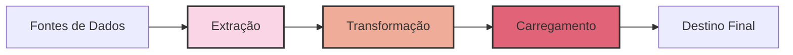
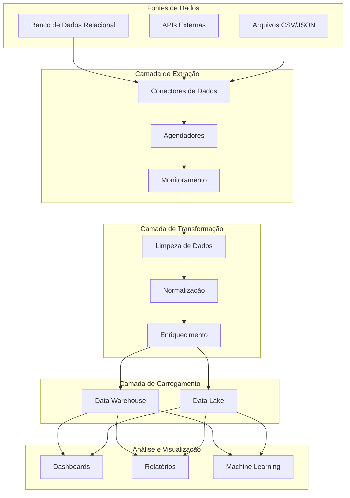
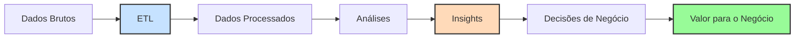

# README do Projeto ETL

## O que é ETL?

ETL (Extract, Transform, Load) é um processo fundamental na engenharia de dados que consiste em três etapas:

1. **Extração** (Extract): Coleta de dados de diversas fontes, como bancos de dados, APIs, arquivos, sistemas legados, etc.
2. **Transformação** (Transform): Limpeza, formatação, enriquecimento e padronização dos dados extraídos.
3. **Carregamento** (Load): Armazenamento dos dados transformados em um destino final, como data warehouse, data lake ou outro sistema de armazenamento.

## O que é Engenharia de Dados?

A Engenharia de Dados é uma disciplina que se concentra na construção e manutenção de sistemas e infraestruturas para coletar, armazenar, processar e disponibilizar dados de forma eficiente e confiável. Os engenheiros de dados são responsáveis por:

- Projetar e implementar pipelines de dados
- Garantir a qualidade e integridade dos dados
- Otimizar o desempenho dos sistemas de dados
- Criar e manter data warehouses e data lakes
- Implementar soluções de processamento de dados em tempo real e em lote

## Sobre o Projeto

Este projeto implementa um pipeline ETL completo que visa resolver [DESCREVER O PROBLEMA DE NEGÓCIO]. Nossa solução automatiza a coleta, processamento e armazenamento de dados, permitindo análises mais rápidas e precisas para tomada de decisões.

### Arquitetura do Projeto

## Objetivo de Negócio

Este projeto foi criado para resolver o seguinte desafio de negócio:

[DESCREVER O PROBLEMA DE NEGÓCIO EM DETALHES]

Nossa solução proporciona:

- **Centralização de Dados**: Reunimos dados de múltiplas fontes em um único repositório
- **Qualidade de Dados**: Implementamos regras de validação e limpeza para garantir a integridade dos dados
- **Eficiência Operacional**: Automatizamos processos que antes eram manuais
- **Insights Valiosos**: Possibilitamos análises avançadas através de dados estruturados e organizados
- **Tomada de Decisão Baseada em Dados**: Fornecemos informações confiáveis para decisões estratégicas

## Fluxo de Valor

## Tecnologias Utilizadas

- [LISTAR TECNOLOGIAS PRINCIPAIS USADAS NO PROJETO]
- [LISTAR FRAMEWORKS E BIBLIOTECAS]
- [LISTAR BANCOS DE DADOS E SISTEMAS DE ARMAZENAMENTO]

## Como Executar o Projeto

[INCLUIR INSTRUÇÕES DETALHADAS SOBRE COMO CONFIGURAR E EXECUTAR O PROJETO]

## Resultados e Métricas

[INCLUIR MÉTRICAS DE DESEMPENHO, RESULTADOS OBTIDOS E BENEFÍCIOS ALCANÇADOS]

## Próximos Passos

[INCLUIR MELHORIAS FUTURAS E EXPANSÕES PLANEJADAS PARA O PROJETO]

---

*Nota: Para personalizar este README completamente, substitua os textos entre colchetes [ASSIM] com as informações específicas do seu projeto.*
